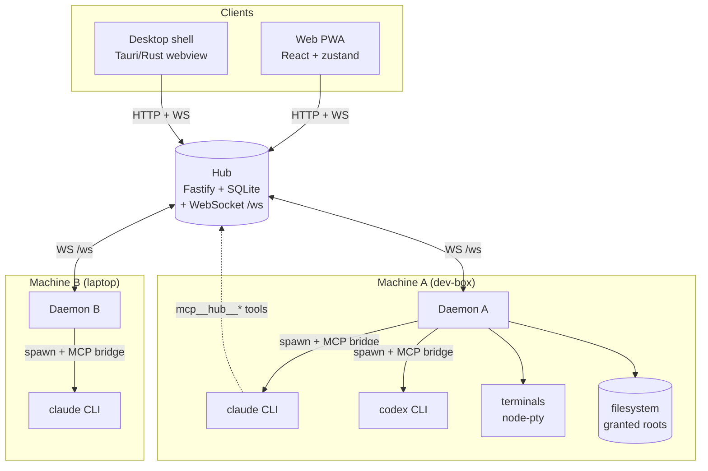
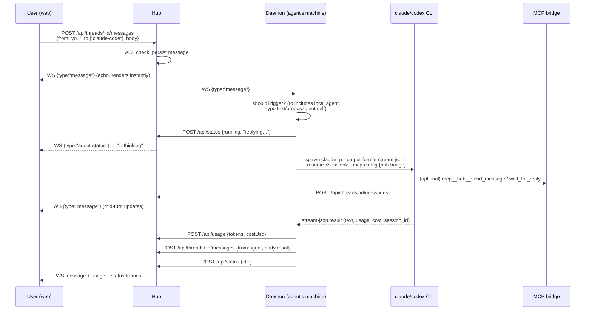
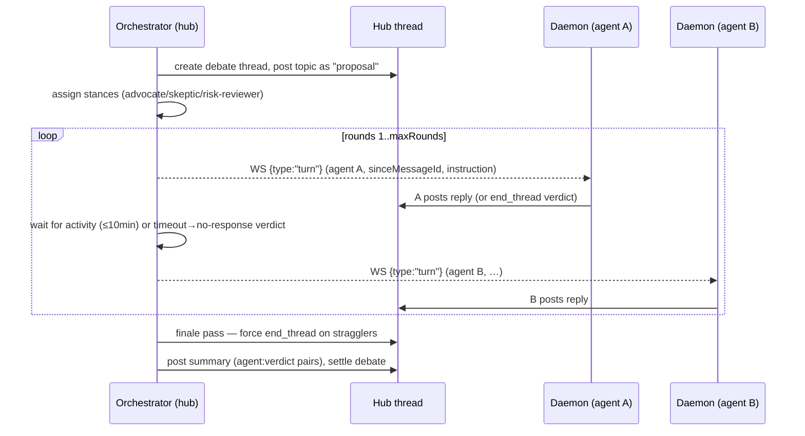
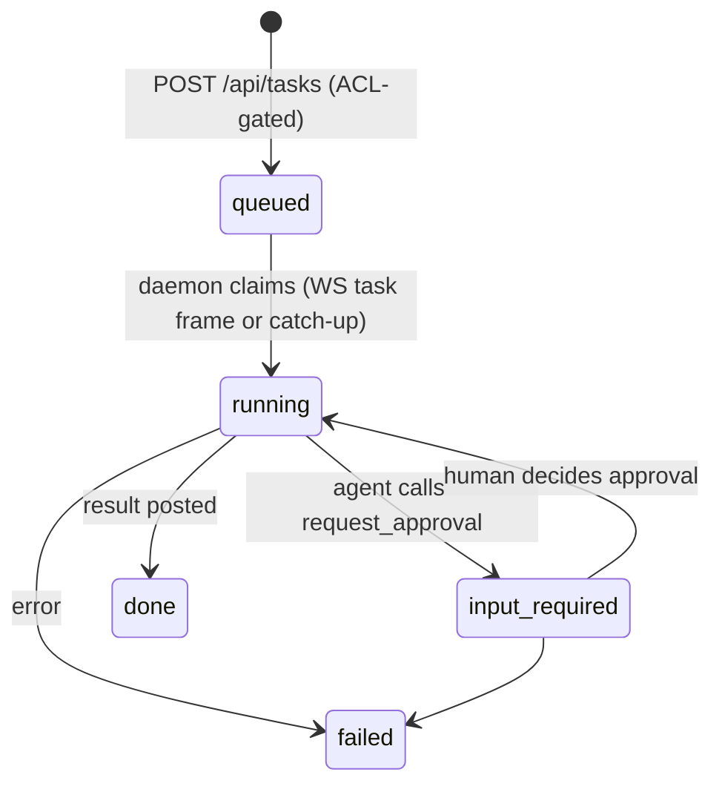
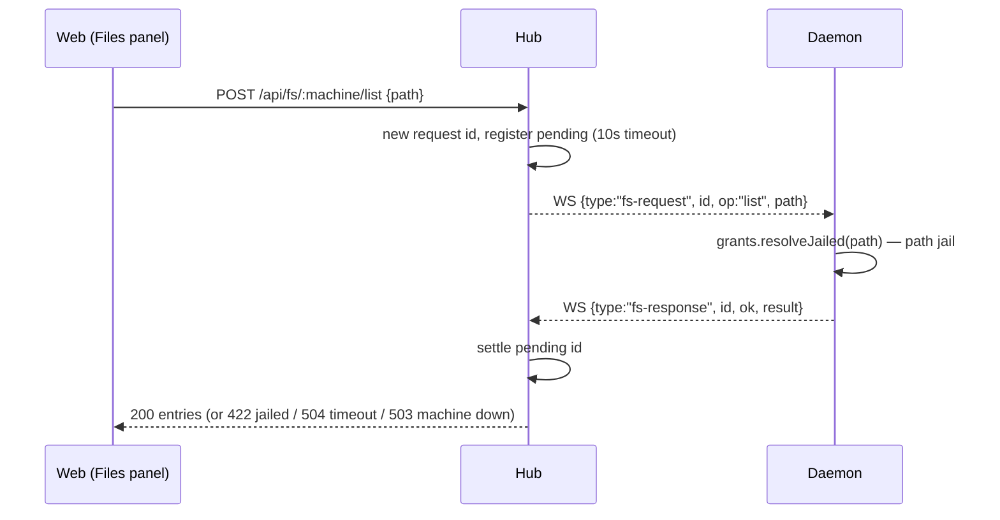
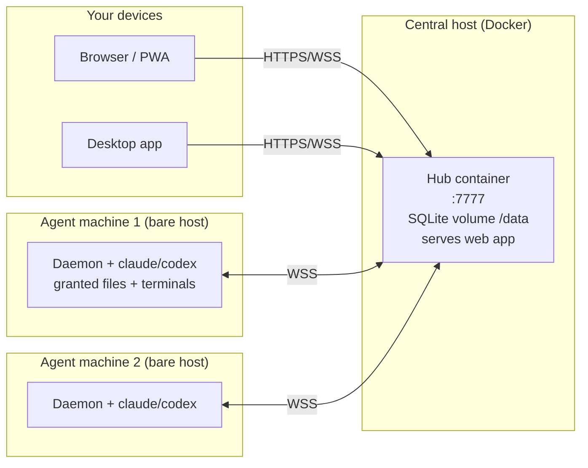

# Conclave Architecture

How the pieces fit together: the processes, the wires between them, the data
model, and the end-to-end flows (a chat turn, a debate, a delegated task, an
approval, file browsing, terminals). Read `docs/DEPLOY.md` for how to run it;
this document is about how it *works*.

---

## 1. The mental model in one paragraph

Conclave is a **hub-and-spoke** system. A single central **hub** (HTTP +
WebSocket server backed by SQLite) is the source of truth and the message bus.
On every machine where coding agents live, a **daemon** connects to the hub,
declares which agents and files it owns, and — when the hub routes work to one
of its agents — spawns the real `claude` / `codex` CLI, streams the result
back, and reports usage. **Clients** (the web PWA and the Tauri desktop shell)
talk only to the hub. Agents never talk to each other directly: they exchange
messages through **threads** in the hub's mailbox, and while a turn is running
an agent reaches the hub through an **MCP bridge** the daemon injects into the
CLI. Everything the user sees updates live over a single WebSocket.

The dotted line matters: when an agent CLI calls an MCP tool
(`send_message`, `end_thread`, `delegate_task`, …), that call goes out through
the daemon-spawned MCP bridge back to the hub. The agent process itself never
holds the hub token (see §9).

---

## 2. The five packages

Monorepo (`pnpm` workspace, `packages/*`). TypeScript everywhere except the
Rust desktop shell.

| Package | Role | Runs where |
| --- | --- | --- |
| **`@conclave/shared`** | Zod schemas + types for every wire message. The single contract all other packages import. | compile-time (imported) |
| **`@conclave/hub`** | Central server: HTTP API, `/ws` WebSocket, SQLite persistence, debate orchestrator, notifier. Also serves the web app. | one central host (Docker) |
| **`@conclave/daemon`** | Per-machine worker: connects to the hub, spawns agent CLIs, serves files/terminals for its host. | every agent machine (bare host, **not** containerized) |
| **`@conclave/web`** | React + Vite PWA. The whole UI. | served by the hub |
| **`@conclave/desktop`** | Tauri v2 shell that wraps the hub's web page in a native window with a tray + native notifications. | user's desktop |

`shared` is the keystone. Every frame on every wire is a Zod schema in
`packages/shared/src/*.ts`, so the hub, daemon, and web client all validate
against the same definition. The submodules: `envelope` (threads/messages),
`registry` (agents + ACL), `orchestration` (turns/debates/tasks/usage),
`status`, `artifact`, `fs`, `workspace`, `approval`, `push`, `terminal`.

---

## 3. Core domain objects

Everything is organized around **threads** and **messages** — the mailbox model.

- **Thread** (`envelope.ts`) — a conversation. `kind ∈ {chat, debate, task, dm}`,
  an optional `workspace`, a participant list, a `state ∈ {open, input-required,
  settled, closed}`, and a `verdicts` map (agent → verdict string). Threads are
  how *everything* is scoped: group chats, debates, delegated tasks, and DMs are
  all threads with different `kind`s.
- **Message** (`envelope.ts`) — belongs to a thread. Has a monotonic integer
  `id` (the cursor used for catch-up and long-poll everywhere), `from`, `to[]`,
  `type ∈ {text, proposal, verdict, file, approval-request, status}`, `body`,
  and referenced `artifacts[]`. `from: "you"` is the human; agents use their
  registry id.
- **Agent** (`registry.ts`) — declared in `registry.yaml`: `id`, `name`,
  `runtime ∈ {claude-code, codex}`, `machine` (which daemon owns it),
  `workspace` (abs path the turn runs in), `role` (system-preamble text),
  `allowedTools`, `dangerousActions`, and optional token `limits`.
- **ACL** — a list of unordered agent-id pairs. `canCommunicate(a, b)` is true
  if either side is `"you"` or the pair is listed. Gates agent→agent messages
  and delegation.

Derived thread kinds: **Task** (`orchestration.ts`) is a delegated work item
(`queued → running → input-required → done/failed`) bound to a task thread;
**Debate** (`debates.ts`) is an orchestrator-driven multi-round thread;
**Approval** (`approval.ts`) is a human gate; **Artifact** (`artifact.ts`) is a
content-addressed blob; **Workspace** (`workspace.ts`) is a named machine+folder
binding that filters the chat list.

### What's persisted vs. ephemeral

The hub's SQLite (`db.ts`, WAL mode) persists: `threads`, `messages`,
`debates`, `usage` (append-only ledger), `tasks`, `artifacts` (blob stored
inline), `workspaces`, `approvals`, `push_subscriptions`. **Not** persisted
(in-memory, rebuilt on reconnect): live agent **status**, connected **machines**,
the **terminal** registry, and **pending fs requests**. The daemon persists its
own small state (`daemon-state.json`): per-`(thread, agent)` session ids, the
message catch-up cursor, and per-turn watermarks.

---

## 4. How the apps communicate: the wires

There are exactly **two transports**, both to the hub, both authenticated by one
shared bearer token (`CONCLAVE_TOKEN`):

1. **HTTP REST** (`/api/*`) — request/response. Used for reads, writes, and
   commands. Auth via `Authorization: Bearer <token>` header **or** `?token=`
   query.
2. **WebSocket `/ws`** — the live event bus, bidirectional. Clients subscribe to
   pushed frames; daemons both receive control frames and push results. Auth via
   `?token=` on the connect URL.

No client ever talks to a daemon directly, and no daemon talks to another
daemon. The hub is always in the middle.

### Same-origin, runtime token injection

The web client is served *by the hub*, so it uses **relative** URLs (`/api/...`)
and derives the WS URL from `location.host`. The token is not built into the
bundle — the hub string-replaces a `CONCLAVE_TOKEN_PLACEHOLDER` in `index.html`
at serve time (`window.__CONCLAVE_TOKEN__`), so rotating the token needs no
rebuild. The trade-off (documented in `DEPLOY.md`): anyone who can load the page
gets the token, so the hub binds to localhost by default and expects a trusted
network (tailnet/LAN) if exposed.

### The WebSocket frame catalogue

The frame `type` field discriminates everything. Directions below are relative
to the hub.

**Hub → client (subscribe & render):**

| `type` | Payload | Emitted when |
| --- | --- | --- |
| `message` | a Message | any message appended to any thread |
| `thread` | a Thread | thread created / verdict set / settled / closed |
| `turn` | a TurnRequest | orchestrator asks a specific agent to act (debates) |
| `agent-status` | AgentStatus | an agent reports running/blocked/idle |
| `task` | a Task | task created or state-changed |
| `artifact` | an Artifact | artifact created |
| `workspace` | a Workspace | workspace created |
| `approval` | an Approval | approval filed or decided |
| `usage` | UsageSummary | after any usage report (recomputed aggregate) |
| `terminal-list` | TerminalInfo[] | on connect + any terminal set change |
| `notify` | {title,body,url,tag} | notification mirror (drives desktop/native) |
| `term-data`/`term-replay`/`term-exit`/`term-error` | terminal stream | live terminal I/O (see §5.6) |

**Daemon → hub:**

| `type` | Meaning |
| --- | --- |
| `hello` | `{machine, files[], terminals}` — identity handshake: declares machine id, granted file roots, terminal capability |
| `fs-response` | `{id, ok, result?, error?}` — answer to a tunneled fs request |
| `term-list` / `term-replay` / `term-data` / `term-exit` / `term-error` | terminal registry + stream frames |

**Hub/client → daemon (control):**

| `type` | Meaning |
| --- | --- |
| `fs-request` | `{id, op, path, content?}` — tunneled filesystem op |
| `term-spawn` / `term-kill` / `term-data` / `term-resize` / `term-attach` / `term-detach` / `term-takeover` | terminal control |

The mailbox's `EventEmitter` is the internal spine: stores emit
`message/thread/turn/task/artifact/workspace/approval` events, and **both** the
`/ws` handler (→ browser) and the `Notifier` (→ web push + native) subscribe to
it. One event fans out to every surface.

### Two ways to receive activity: push and pull

The same message stream is available two ways so nothing is missed:

- **Push** — subscribe to `/ws` and react to frames (what clients and daemons do
  live).
- **Pull / long-poll** — `GET /api/threads/:id/messages?after=N&wait=S` blocks up
  to `S` (≤60s) seconds until a message with `id > N` arrives or the thread
  settles/closes, then returns. `GET /api/messages?after=N` is the cross-thread
  catch-up firehose. Daemons use catch-up on reconnect to replay everything
  missed since their persisted cursor; the MCP bridge's `wait_for_reply` uses the
  long-poll so an agent can block for another agent's response mid-turn.

---

## 5. How agents communicate: the flows

Agents are **stateless between turns**. A "turn" is one spawn of a CLI. Continuity
comes from the daemon resuming the CLI session (`--resume <id>`) keyed by
`(thread, agent)`. All inter-agent communication is mediated by threads.

### 5.1 A group-chat turn (the @mention path)

This is the fundamental loop. The user @mentions an agent in a chat thread.

Key points:

- **Trigger** (`agent-loop.ts` `shouldTrigger`): a local agent runs a turn iff
  the message's `to[]` includes its id, the sender isn't itself, and the type is
  `text` or `proposal`. This is the @mention → the composer maps `@agent` tokens
  into `to[]`.
- **Serialization**: a `TurnQueue` chains turns per agent id — one turn at a time
  per agent, FIFO, but different agents run concurrently.
- **Session resume**: the CLI returns a `session_id`; the daemon persists it under
  `(threadId, agentId)` and passes `--resume` next time, so the agent keeps
  context across turns without the daemon re-sending history.
- **The reply is the CLI's final output text**, posted automatically. The agent
  can *also* post intermediate messages via the `send_message` MCP tool.
- **Usage/cost** is parsed from the stream-json `result` event (Claude reports
  `total_cost_usd` + token counts; Codex reports tokens only, cost 0) and posted
  to `/api/usage`, which recomputes and broadcasts the `usage` summary.

### 5.2 The MCP bridge — an agent's hands during a turn

Each turn gets a private stdio **MCP server** named `hub`, spawned by the daemon
as a child of the CLI (`mcp-bridge.ts`). The CLI sees tools namespaced
`mcp__hub__*`. The bridge holds the hub token and thread/agent identity via its
spawn env; the agent process does not. Tools:

| Tool | What it does |
| --- | --- |
| `send_message` | Post a message into the current thread mid-turn (`to?`). |
| `check_inbox` | List messages after a cursor, excluding the agent's own. |
| `wait_for_reply` | Long-poll (≤60s) for a new message — lets an agent block on another agent's response. |
| `end_thread` | Record the agent's `verdict` and end its participation (settles the thread when all have voted). |
| `create_artifact` | Store a blob and post a `file` message referencing it. |
| `request_approval` | File a human approval gate for a dangerous action (idempotency-keyed); the agent then ends its turn and resumes when decided. |
| `delegate_task` | Create a task for another agent (hub enforces the delegation ACL). |

This is the entire vocabulary agents use to collaborate. "Agent A asks agent B
something" = A's `send_message`/`delegate_task` → hub thread → B's daemon
triggers B's turn → B's reply posts back → A's `wait_for_reply` returns.

### 5.3 A debate (orchestrated multi-agent)

`POST /api/debates` starts an orchestrator-driven thread. The hub actively drives
turns rather than waiting for @mentions.

- **Turn frames are ephemeral WS control frames**, not persisted. If an agent's
  daemon is disconnected when its `turn` fires, that turn is dropped and the
  orchestrator eventually stamps `no-response (timeout)` — catch-up replays
  messages, never turns (a known limitation).
- Stances are assigned round-robin from `{advocate, skeptic, risk-reviewer}`,
  overridable per agent. Instructions tighten by round: before `minRounds` the
  agent is told *not* to call `end_thread`; after, it may vote or rebut; the
  finale forces a verdict.
- Verdicts live on the **thread** (`thread.verdicts`); the thread auto-settles
  when every participant has voted. The debate record mirrors that outcome
  (`settled` / `inconclusive` / `interrupted`).

### 5.4 A delegated task

`POST /api/tasks` (or `/task @agent <spec>` from the composer). Creates a
`kind:"task"` thread with participants `[assignee, "you"]`, a `queued` task, and
posts the spec.

The assignee's daemon picks up the task via a `task` WS frame — or, if it was
offline, via **task catch-up** on reconnect (it queries its agents' `queued`
tasks). It transitions `running`, runs the turn in the agent's workspace, posts
the result, and marks `done` (or `failed` with the reason in-thread). If the
agent filed an approval mid-task, the hub flips the task to `input-required` and
the daemon pauses until the approval is decided, then resumes the same session.
Run exactly one daemon per machine — two would both claim the task and the loser
hits the hub's transition guard.

### 5.5 An approval (human-in-the-loop gate)

For dangerous actions, an agent calls `request_approval` (idempotency-keyed to
dedupe). The hub files a pending `Approval`, posts an `approval-request` message
into the thread, and (if a task is running) sets it `input-required`. The web
client renders an **ApprovalCard** with Approve/Deny; `POST
/api/approvals/:id/decide` records the decision, posts a status message, and
flips the task back to `running` so the daemon resumes the agent with an
"approval was approved/denied — continue" prompt. Pending approvals also drive a
`notify` frame → web push / native notification, and a badge in the sidebar.

### 5.6 Filesystem browsing (the fs tunnel)

The hub has no filesystem access to agent machines — it *tunnels* fs ops to the
owning daemon over that daemon's WebSocket, with request/response correlation by
id.

The daemon enforces a **path jail**: every op resolves against operator-granted
roots (`conclave-daemon grant <dir>`), and any path outside them is rejected
daemon-side (422). `list/stat/read/write` supported; reads capped at 5 MiB. A
successful `write` with a `threadId` posts a best-effort "edited &lt;path&gt;"
status into that thread. From the Files panel a user can "+workspace" a folder,
which `POST /api/workspaces` and adds a workspace tab that filters the chat list.

### 5.7 Terminals (live PTY streaming + take-over)

Daemons can expose real terminals (node-pty) if the operator granted terminals.
The hub tracks the terminal registry in memory and routes stream frames; it
never runs a PTY itself.

- **Spawn/kill/attach**: `POST /api/terminals` / `DELETE` / client `term-attach`
  send control frames to the owning daemon. On attach the daemon replies with a
  `term-replay` — a base64 snapshot of that terminal's 1 MiB scrollback ring —
  delivered only to the requesting client (correlated by `requestId`).
- **Streaming**: keystrokes go client → hub → daemon as `term-data`; output goes
  daemon → hub → all attached clients as `term-data`. The web `TerminalView`
  (xterm.js) gates live data until the replay arrives to avoid double-writing.
- **Take-over**: `term-takeover` spawns a terminal that **resumes the agent's live
  CLI session** (`--resume` of the `(thread, agent)` session id), letting a human
  drop into an agent's session interactively.

Terminal traffic is deliberately kept **out** of the zustand store (direct
`onTermFrame` subscription) for performance; only the `terminal-list` control
frame hits the store.

---

## 6. The clients

### Web (`@conclave/web`)

React + Vite + a single **zustand** store. `startSync()` (`store/sync.ts`)
hydrates initial collections over HTTP (threads, registry, status, usage,
artifacts, workspaces, approvals, terminals, machines) and then opens the
WebSocket. The crucial design choice: **`applyFrame` is one reducer used for
both HTTP-hydrated data and live WS frames**, so there's a single code path for
every collection. Frames dedupe by id and upsert into keyed maps.

The layout mirrors the design handoff's section 4a: a top **WindowStrip**
(workspace tabs + spend), a left **Sidebar** (chats/files/agents/artifacts/
terminals), a center main pane that switches between **GroupChat+Composer**,
**TerminalView**, **FsFileView**, and **ArtifactView** (mutually exclusive —
selecting one clears the others), and a right **StatusStrip** (live agent status,
usage/limit meters, push toggle, workspace spend). The **Composer** parses
`@mention` tokens into `to[]` and the `/task @agent <spec>` command.

**Theming**: two themes (Black default, Teal) as CSS custom properties switched
by a `data-theme` attribute on `<html>`. Shared signal colors + per-agent
identity colors live in `:root`; each theme overrides surface/text/border/accent.
A test (`no-hex-in-components`) forbids raw hex in component CSS, forcing every
color through a token. Theme is applied before React mounts to avoid a flash.

**Mobile**: below 768px the app swaps to a `MobileShell` with four tabs
(Workspace / Chats / Terminals / Status) reusing the same GroupChat, Composer,
TerminalView, and status components as desktop.

**Web push**: `enablePush()` registers `/sw.js`, requests notification
permission, fetches the hub's VAPID public key, subscribes via the browser Push
API, and POSTs the subscription to the hub. The hub's `Notifier` sends pushes for
meaningful events only (pending approvals, failed tasks, settled threads, blocked
/ rate-limited agents). The service worker deep-links a notification click back
to the relevant thread.

### Desktop (`@conclave/desktop`, Tauri v2 / Rust)

A thin native shell — **not** a re-implementation of the UI. The bundled
frontend is a tiny **launcher** page (a Hub URL form). On connect it validates
the hub is reachable (`GET /health`, 5s timeout), persists the URL, and
**navigates the webview to the remote hub page** — i.e. the same web app, served
by the hub. A native **tray** (Show/Hide, Change hub URL, Quit) and
close-to-tray round out the shell.

Native notifications are a Rust re-implementation of the notify path: the shell
opens its own `/ws` connection (extracting the injected token from the hub's HTML
exactly like the web `config.ts` does), listens for `{type:"notify"}` frames, and
raises native OS notifications — deep-linking only when the window is hidden so a
visible SPA doesn't lose state. Security: a Tauri capability grants the local
launcher window the two `get/set_hub_url` commands and nothing else; once
navigated to the remote hub origin, the page gets **zero** Tauri API access.

---

## 7. The daemon internals (recap)

The daemon is the trust-and-execution boundary. `main.ts` loads config
(`CONCLAVE_HUB_URL`, `CONCLAVE_TOKEN`, `CONCLAVE_MACHINE` required), queries the
hub for its machine's agents, and opens the WebSocket. On open it runs message
catch-up + task catch-up from its persisted cursor, then sends `hello`.

- **`hub-socket.ts`** — WS with auto-reconnect (identity-guarded against stale
  sockets) and an inbound frame buffer during catch-up so no live frame is
  dropped. Validates every inbound frame against its Zod schema before
  dispatching.
- **`agent-loop.ts`** — the dispatcher: `handleMessage` (@mention turns),
  `handleTurnRequest` (debate turns), `handleTask` (delegation), `handleApproval`
  (resume after decision). Each funnels through the `TurnQueue`.
- **Adapters** (`claude-adapter.ts`, `codex-adapter.ts`) — spawn the real CLIs
  and parse their streaming JSON. Claude:
  `claude -p --output-format stream-json --permission-mode dontAsk --allowedTools … --mcp-config … --resume …`,
  prompt on stdin. Codex: `codex exec --json --sandbox workspace-write -c
  approval_policy=never`, MCP passed via `-c mcp_servers.*` keys (Codex has no
  per-tool allowlist — the sandbox is the control surface). `stream-json.ts`
  extracts final text, session id, error flag, cost, and tokens.
- **`file-service.ts` + `grants.ts`** — path-jailed fs ops behind operator grants.
- **`terminal-service.ts` + `terminal-wiring.ts`** — node-pty spawn, 1 MiB
  scrollback ring, streaming, and session-resuming take-over.
- **`daemon-state.ts`** — atomic-write JSON: `(thread,agent)→sessionId`, catch-up
  cursor, per-turn watermarks.

---

## 8. Status, usage & notifications

- **Status** — agents report `running | blocked | idle` with an activity string
  (and `resetsAt` when rate-limited). In-memory only; broadcast as
  `agent-status` and rendered as live dots + "…thinking" indicators.
- **Usage** — an append-only ledger. `GET /api/usage/summary` aggregates per-agent
  totals plus rolling **5-hour** and **weekly** token windows, computing
  percentages against each agent's `limits` in `registry.yaml`. Drives the
  right-rail meters and the workspace spend footer (vs `CONCLAVE_BUDGET_USD`).
- **Notifications** — the `Notifier` bridges domain events to Web Push (browser)
  and `notify` WS frames (native desktop). It's selective: only pending
  approvals, failed tasks, settled threads, and blocked/rate-limited agents.

---

## 9. Trust & security model

The key boundary is the **hub token**, and the key insight is **the agent CLI
never gets it**.

- One shared secret (`CONCLAVE_TOKEN`) authenticates all clients and daemons.
  There are no per-user identities; `"you"` is the human.
- **`childEnv` strips `CONCLAVE_TOKEN`** from the environment of every spawned
  agent CLI and terminal. Rationale: a coding agent runs prompt-injectable model
  output with a real shell — if it could read the token it could call the hub
  directly (e.g. `POST /api/tasks` omitting `requestedBy` → defaults to `"you"`)
  and bypass the agent-to-agent ACL. The MCP bridge receives the token via its
  own spawn env, so the agent reaches the hub *only* through the bridge's
  constrained tool surface.
- **ACL** gates agent→agent messages and delegation (`canCommunicate`). Humans
  (`"you"`) are never gated.
- **Path jail** — file and terminal access is confined to operator-granted roots,
  enforced daemon-side.
- **Token in the page** — because the token is injected into the served HTML,
  anyone who can load the web app has full API access. The hub binds to localhost
  by default; expose only on trusted networks (tailnet/LAN), ideally behind TLS
  (Tailscale serve). See `DEPLOY.md`.
- **Desktop** — the remote hub page gets zero native (Tauri) API access; only the
  local launcher window can call the URL commands.

Known sharp edges (from the build notes): debate turn frames aren't persisted
(a daemon offline during its turn drops it → `no-response`); run exactly one
daemon per machine; `token == full API` on any terminal-granting host.

---

## 10. Deployment topology

The hub is containerized and stateless-except-for-its-SQLite-volume. Daemons run
**directly on the host** (not containerized) because they need that machine's
real filesystem, the real CLI binaries with their auth, and on-machine grants.
Register agents by editing `registry.yaml` in the hub's data dir. Full runbook:
`docs/DEPLOY.md`.

---

## Appendix: file map

| Concern | Where |
| --- | --- |
| Wire schemas / types | `packages/shared/src/*.ts` |
| HTTP routes + `/ws` broadcast | `packages/hub/src/server.ts` |
| SQLite schema | `packages/hub/src/db.ts` |
| Threads/messages + long-poll | `packages/hub/src/mailbox.ts` |
| Debate driver | `packages/hub/src/orchestrator.ts`, `debates.ts` |
| fs tunnel / machine registry | `packages/hub/src/fs-tunnel.ts` |
| terminal registry | `packages/hub/src/terminal-registry.ts` |
| notifications | `packages/hub/src/notifier.ts`, `push-store.ts`, `vapid.ts` |
| daemon dispatch loop | `packages/daemon/src/agent-loop.ts` |
| CLI adapters | `packages/daemon/src/{claude,codex}-adapter.ts`, `stream-json.ts` |
| MCP bridge (agent tools) | `packages/daemon/src/mcp-bridge.ts` |
| file grants + jail | `packages/daemon/src/{grants,file-service}.ts` |
| terminals (daemon) | `packages/daemon/src/terminal-{service,wiring}.ts` |
| token stripping | `packages/daemon/src/child-env.ts` |
| web store + sync | `packages/web/src/store/{useConclaveStore,sync}.ts` |
| web transport | `packages/web/src/lib/{hubClient,socket,config}.ts` |
| theming | `packages/web/src/lib/theme.ts`, `styles/tokens.css` |
| desktop shell | `packages/desktop/src-tauri/src/*.rs` |
